## 背景

Pool Coordinator 是边缘节点池中一个重要的组件，它是一个由 apiserver 和使用内存存储数据的 etcd 组成的 Pod。

边缘节点池中的 node 会通过 Pool Coordinator 选出一个主节点，节点池依赖此主节点做云端探活；Pool Coordinator 也用于备份边缘节点的本地资源。

本文中，我们将对 Pool Coordinator 的性能进行测试，并给出一个推荐的 Pool Coordinator 资源配置。

## 测试环境

### Kubernetes 版本

`Major:"1", Minor:"22", GitVersion:"v1.22.0", GitCommit:"c2b5237ccd9c0f1d600d3072634ca66cefdf272f", GitTreeState:"clean", BuildDate:"2021-08-04T17:57:25Z", GoVersion:"go1.16.6", Compiler:"gc", Platform:"linux/amd64"`

### Node 配置

Master 节点与 worker 节点均使用运行在 VMWare Fusion 中的虚拟机。

#### 操作系统

|  | Master  | Node  |
| --- | --- | --- |
| LSB Version  | :core-4.1-amd64:core-4.1-noarch | :core-4.1-amd64:core-4.1-noarch |
| Distributor ID  | CentOS | CentOS |
| Description | CentOS Linux release 8.4.2105 | CentOS Linux release 8.4.2105 |
| Release  | 8.4.2105 | 8.4.2105 |

#### CPU

|  | Master  | Node  |
| --- | --- | --- |
| Architecture  | x86_64 | x86_64 |
| CPU op-mode (s) | 32-bit, 64-bit | 32-bit, 64-bit |
| Byte Order  | Little Endian | Little Endian  |
| CPU (s) | 4 | 4 |
| On-line CPU(s) list | 0-3 | 0-3 |
| Thread(s) per core | 1 | 1 |
| Core(s) per socket | 1 | 1 |
| Socket(s)  | 4 | 4 |
| NUMA node(s) | 1 | 1 |
| Vendor ID  | GenuineIntel | GenuineIntel |
| CPU family  | 6 | 6 |
| Model  | 158 | 158 |
| Model name  | Intel(R) Core(TM) i7-9750H CPU @ 2.60GHz | Intel(R) Core(TM) i7-9750H CPU @ 2.60GHz |
| Stepping  | 10 | 10 |
| CPU MHz | 2592.000 | 2592.000 |

#### 内存
|  | Master  | Node  |
| --- | --- | --- |
| Total memory  | 7829472 K | 7829472 K |

#### 磁盘
|  | Master              | Node                |
| --- |---------------------|---------------------|
| Total Size   | 20GiB   | 20GiB   |


## 测试方法

1. 启动 pool-coordinator，观察初始时的资源占用情况。
2. 向 pool-coordinator 中写入 1000 个 Pod 和 500 个 Node。其中，单个 Pod、Node 资源大小均约为 8kb，观察写入后的资源占用情况。
3. 删除 pool-coordinator 中的所有 Pod 和 Node 资源，观察资源占用情况。
4. 向 pool-coordinator 中再次写入 1000 个 Pod 和 500 个 Node，并持续随机更新 Pod、Node 信息，观察资源占用情况。
5. 请求 pool-coordinator 选主，观察是否成功。

## 测试结果

### 第一阶段

启动 pool-coordinator，观察 CPU 和内存的占用情况（pause 容器和 kubectl 容器占用较少，暂不统计，下同）：

* CPU 占用量约为 70m ~ 90m。
* 内存占用量约为 370MB。其中，apiserver 约占用 205MB；etcd 约占用 165MB。

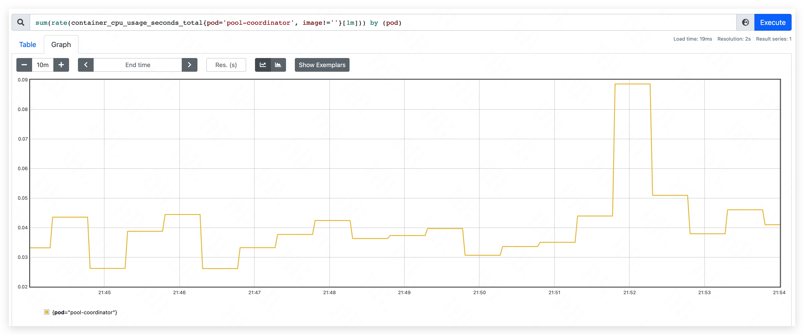
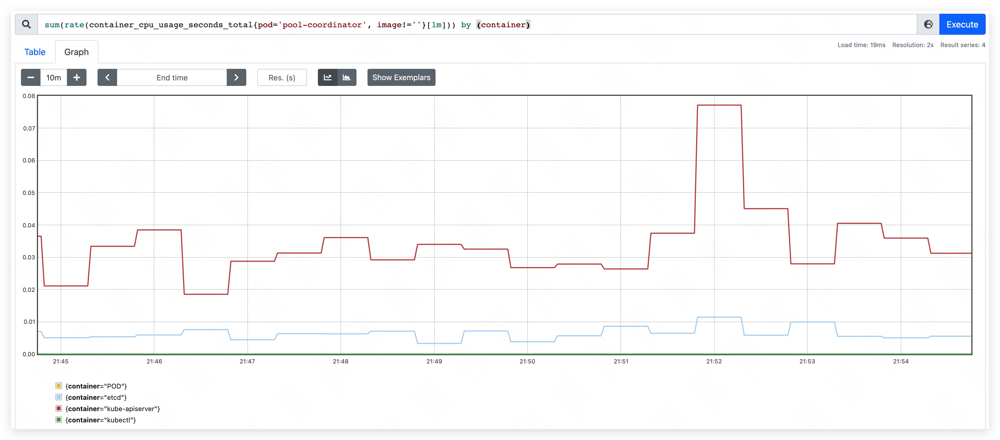
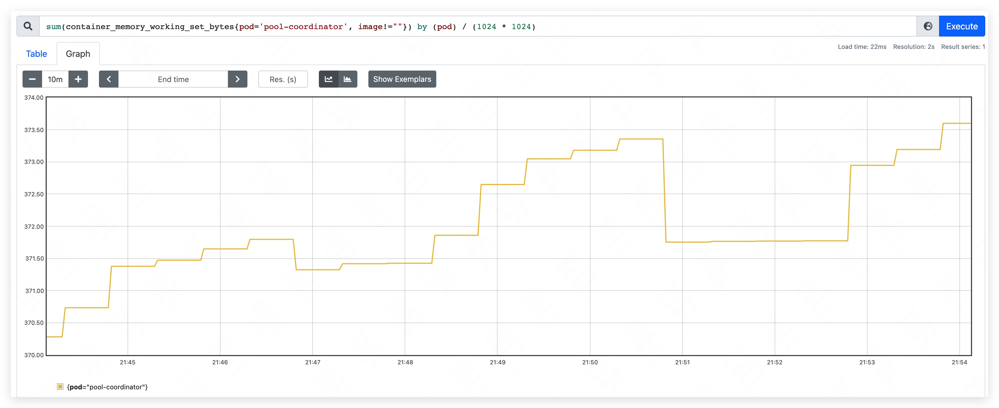


### 第二阶段

向 pool-coordinator 中写入 1000 个 Pod 和 500 个 Node 资源，观察 CPU 和内存的占用情况：

* CPU 峰值使用量约为 310m，整体涨幅不明显。其中，apiserver CPU 使用量略有上涨；etcd 变化不明显。
* 内存占用量约为 450MB。其中，apiserver 约占用 240MB；etcd 约占用 210MB。

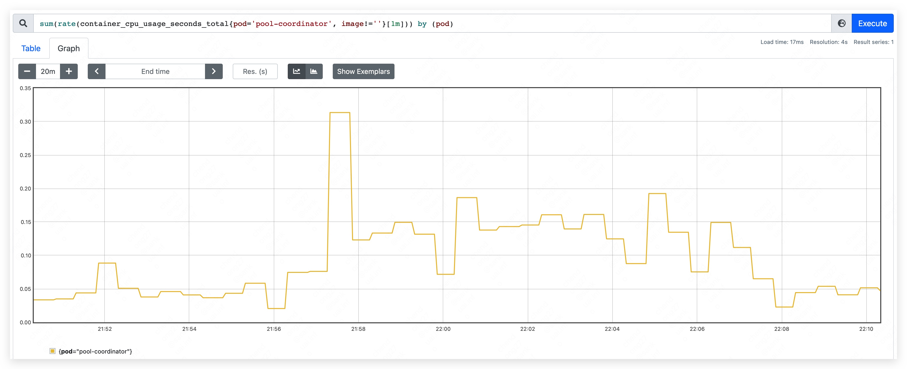
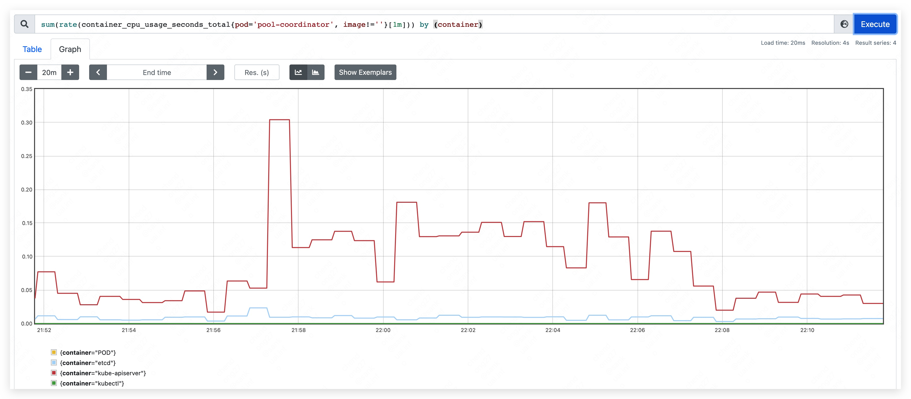


### 第三阶段

删除 pool-coordinator 中的所有 Pod 和 Node 资源，观察资源占用情况。

* CPU 峰值使用量约为 260m，变化不明显。
* 内存占用量最高约到 590MB。其中，apiserver 约占用 350MB；etcd 约占用 240MB。

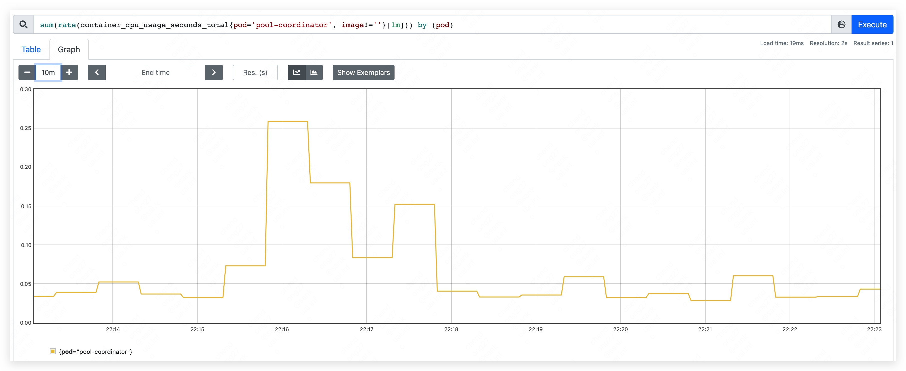
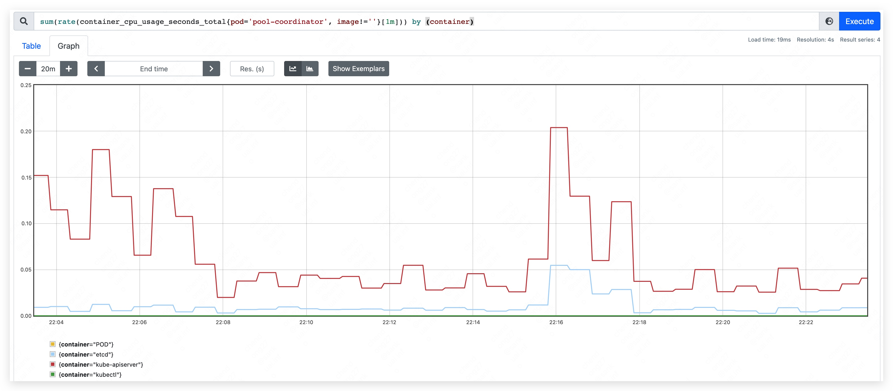
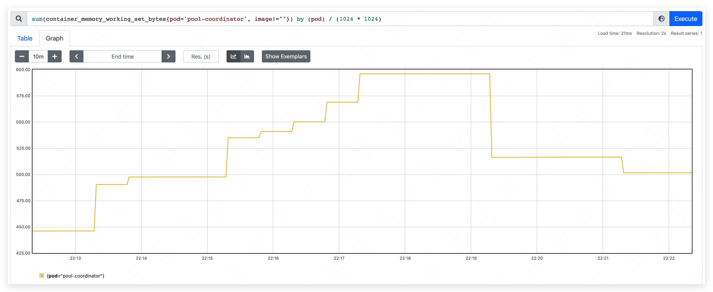
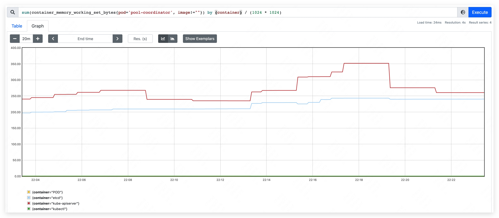


### 第四阶段

向 pool-coordinator 中再次写入 1000 个 Pod 和 500 个 Node，并持续随机更新 Pod、Node 信息，观察资源占用情况。

* CPU 使用量最高位约为 640m。
* 内存使用量持续上涨，直到 etcd container 发生 OOM。


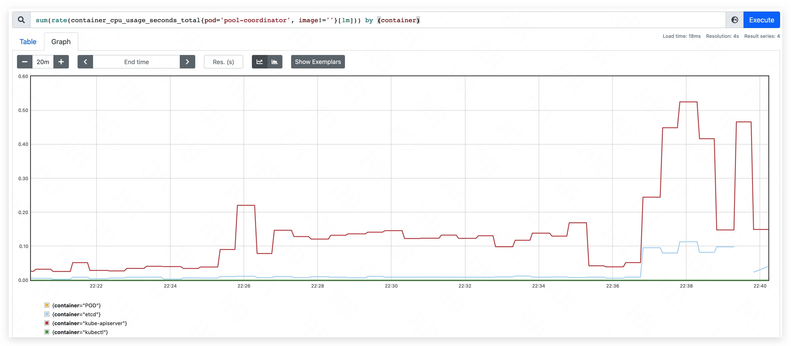

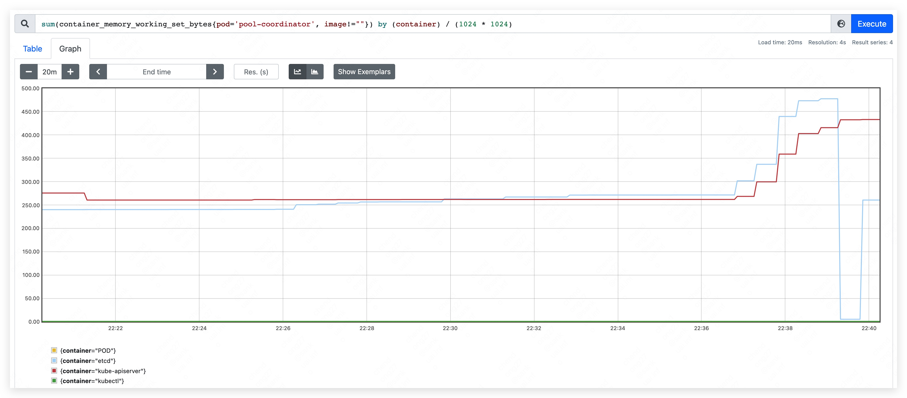


### 第五阶段

启动外部程序，请求 pool-coordinator 选主，选主成功。

```shell
I1103 20:47:15.123746   87201 leaderelection.go:248] attempting to acquire leader lease default/test-lock...
I1103 20:47:15.260887   87201 leaderelection.go:258] successfully acquired lease default/test-lock
I1103 20:47:15.260951   87201 main.go:465] Controller loop...
```

查看 pool-coordinator 中 lease 信息，创建成功。

```shell
$ kubectl get lease
NAME        HOLDER                                 AGE
test-lock   2cd06119-8be6-4e0e-a6aa-398f1eca32c0   102s
```

## 结论

当 NodePool 内的资源在一定数量内（Pod：1000，单个 8KB；Node 500，单个 8KB）时，pool-coordinator 的最小资源占用量约为 CPU 310m、内存 450MB。

由于 etcd 自身的存储机制，删除资源并不会让 pool-coordinator 的内存用量下降，反而短期会导致内存用量上涨。

短时间内频繁更新资源，将导致 etcd 中的 revision 变多，引发 etcd 数据量快速上涨。如 etcd container 配置了 resource limit，则会使得 container 触发 OOM。

根据测试结果可知，CPU 并非资源瓶颈；而内存在极端情况下会暴涨，影响边缘资源使用效率。

故当单个边缘节点池的 Node 数量小于 500、Pod 数量小于 1000 时，推荐使用以下资源限制配置：

```yaml
apiserverResources:
  requests:
    cpu: 250m
---
etcdResources:
  limits:
    cpu: 200m
    memory: 512Mi
  requests:
    cpu: 100m
    memory: 256Mi
```